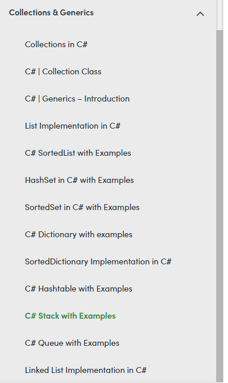

## Collections

https://www.geeksforgeeks.org/c-sharp-stack-with-examples/?ref=lbp



## stack


```c#
// C# program to illustrate how to
// create a stack
using System;
using System.Collections;

class GFG {

	// Main Method
	static public void Main()
	{

		// Create a stack
		// Using Stack class
		Stack my_stack = new Stack();

		// Adding elements in the Stack
		// Using Push method
		my_stack.Push("Geeks");
		my_stack.Push("geeksforgeeks");
		my_stack.Push('G');
		my_stack.Push(null);
		my_stack.Push(1234);
		my_stack.Push(490.98);

		// Accessing the elements
		// of my_stack Stack
		// Using foreach loop
		foreach(var elem in my_stack)
		{
			Console.WriteLine(elem);
		}
	}
}

```

**Output:** 

```
490.98
1234

G
geeksforgeeks
Geeks
```

```c#
// C# program to illustrate how to
// remove elements from the stack
using System;
using System.Collections;

class GFG {

	// Main Method
	static public void Main()
	{

		// Create a stack
		// Using Stack class
		Stack my_stack = new Stack();

		// Adding elements in the Stack
		// Using Push method
		my_stack.Push("Geeks");
		my_stack.Push("geeksforgeeks");
		my_stack.Push("geeks23");
		my_stack.Push("GeeksforGeeks");

		Console.WriteLine("Total elements present in"+
					" my_stack: {0}", my_stack.Count);
													
		my_stack.Pop();

		// After Pop method
		Console.WriteLine("Total elements present in "+
					"my_stack: {0}", my_stack.Count);

													
		// Remove all the elements
		// from the stack
		my_stack.Clear();

		// After Pop method
		Console.WriteLine("Total elements present in "+
					"my_stack: {0}", my_stack.Count);
													
	}
}
c
```

**Output:** 

```
Total elements present in my_stack: 4
Total elements present in my_stack: 3
Total elements present in my_stack: 0
```

#### How to get the topmost element of the Stack?

In Stack, you can easily find the topmost element of the stack by using the following methods provided by the Stack class:

- [**Pop**](https://www.geeksforgeeks.org/stack-pop-method-in-c-sharp/)**:** This method returns the object at the beginning of the stack with modification means this method removes the topmost element of the stack.
- [**Peek**](https://www.geeksforgeeks.org/stack-peek-method-in-c-sharp/)**:** This method returns the object at the beginning of the stack without removing it.