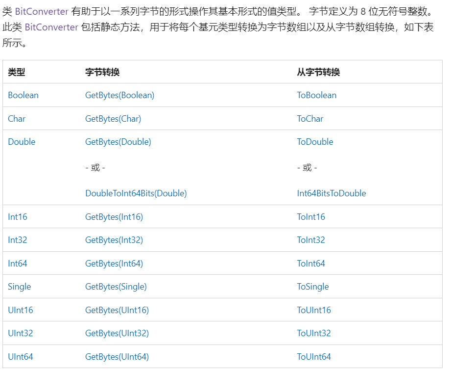

## 基础教程

参考 菜鸟教程 C#

https://www.runoob.com/csharp/csharp-tutorial.html

基础数据类型


```c#
char = 'A';
int a = 1;
// int16 int32 int64
float b = 1.0;
double c = 1.0;
string str  = "12323abc";

```


https://learn.microsoft.com/zh-cn/dotnet/api/system?view=net-6.0

### 类型转换


1.将字符串string转int

```c#
string str = "12";
int number = int.Parse(str);
```

2.将字符串string转float

```c#
string str = "12.2";
float number = float.Parse(str);
```

3. float 转 int

```c#
// 强制转换 double 为 int
float number = 1.3;
int a = (int)number;
```

 {*0:X*}表示输出十六进制

 Console.Write("{0:x}", pk[i]);

### C#进制间的转换

1. [十进制转二进制](http://lijiancheng0614.github.io/2015/04/19/2015_04_19_CSharp_Number_System/#十进制转二进制)
2. [十进制转十六进制](http://lijiancheng0614.github.io/2015/04/19/2015_04_19_CSharp_Number_System/#十进制转十六进制)
3. [二进制转十进制](http://lijiancheng0614.github.io/2015/04/19/2015_04_19_CSharp_Number_System/#二进制转十进制)
4. [二进制转十六进制](http://lijiancheng0614.github.io/2015/04/19/2015_04_19_CSharp_Number_System/#二进制转十六进制)
5. [十六进制转十进制](http://lijiancheng0614.github.io/2015/04/19/2015_04_19_CSharp_Number_System/#十六进制转十进制)
6. [十六进制转二进制](http://lijiancheng0614.github.io/2015/04/19/2015_04_19_CSharp_Number_System/#十六进制转二进制)

把`string`变量 `x` 转换为另一种进制的`string`

第一行为直接转换，

第二行为数字宽度为6（前面不足补0），总宽度为8的字符串。


1. 十进制转二进制

```
Convert.ToString(Convert.ToInt62(x), 2)
string.Format("{0,8}", Convert.ToString(Convert.ToInt62(x), 2).PadLeft(6, '0'))
```

2. 十进制转十六进制

```
Convert.ToString(Convert.ToInt62(x), 16)
string.Format("{0,8:X6}", Convert.ToString(Convert.ToInt62(x), 16))
```

3. 二进制转十进制

```
Convert.ToInt62(x, 2).ToString()
string.Format("{0,8:d6}", Convert.ToInt62(x, 2))
```

4. 二进制转十六进制

```
Convert.ToInt62(x, 2).ToString("X")
string.Format("{0,8:X6}", Convert.ToInt62(x, 2))
```

5. 十六进制转十进制

```
Convert.ToInt62(x, 16).ToString()
string.Format("{0,8:d6}", Convert.ToInt62(x, 16))
```

6. 十六进制转二进制

```
Convert.ToString(Convert.ToInt62(x, 16), 2)
string.Format("{0,8}", Convert.ToString(Convert.ToInt62(x, 16), 2).PadLeft(6, '0'))
```

 **10进制与16进制 相互转换**

Modbus通讯中经常会用到10进制与16进制之间的转换。

// 方式1，无法进行自动补0

```
string data1 = Convert.ToString(17194, 16); // 432A
string data2 = Convert.ToString(0, 16); // 0
```


// 方式2，自动补0

```
string data3 = 17194.ToString("X4"); // 432A
string data4 = 0.ToString("X2"); // 00
string data5 = 0.ToString("X4"); // 0000
```


X：代表16进制

4：代表每次的数据位数，当位数不足时自动补0

原文链接：https://blog.csdn.net/w405722907/article/details/90231238


### Convert类

https://learn.microsoft.com/en-us/dotnet/api/system.convert.todatetime?view=net-6.0


```
result = Convert.ToInt64(value);
Convert.ToInt64(str, 2)
Convert.ToDateTime
Convert.ToByte
Convert.ToHexString
```

英语： https://learn.microsoft.com/en-us/dotnet/api/system.convert.toint64?view=net-6.0

中文：https://learn.microsoft.com/zh-cn/dotnet/api/system.convert.toint64?view=net-6.0


### BitConverter 类

基数据类型 =》字节数组 byte[]

https://learn.microsoft.com/zh-cn/dotnet/api/system.bitconverter?view=net-6.0




### Byte  8 位无符号整数


# Lambda 表达式

chinese：https://learn.microsoft.com/zh-cn/dotnet/csharp/language-reference/operators/lambda-expressions

english：https://learn.microsoft.com/en-us/dotnet/csharp/language-reference/operators/lambda-operator


(input-parameters) => expression


(input-parameters) => { <sequence-of-statements> }
