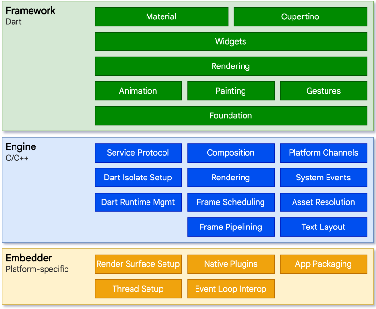
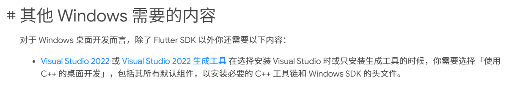
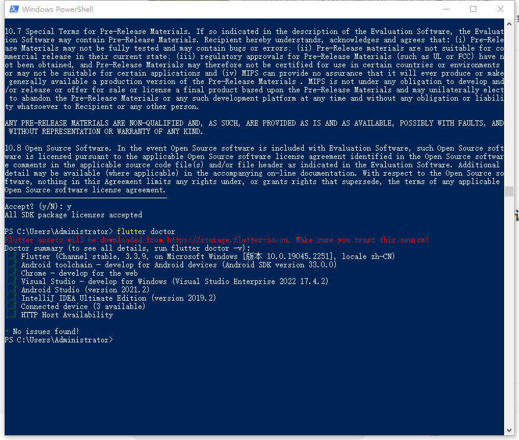
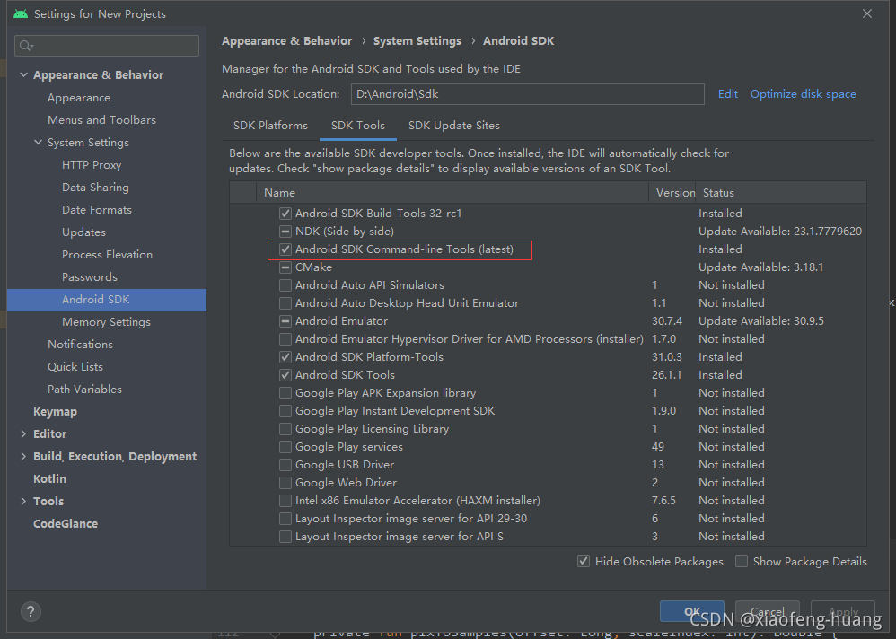
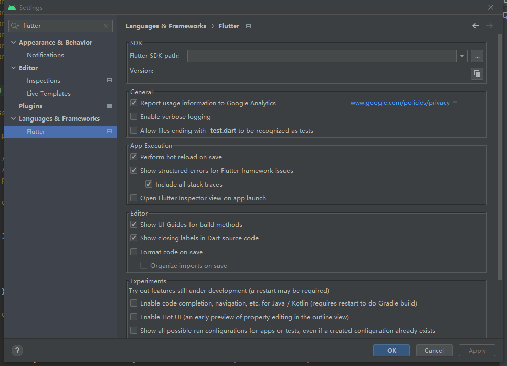
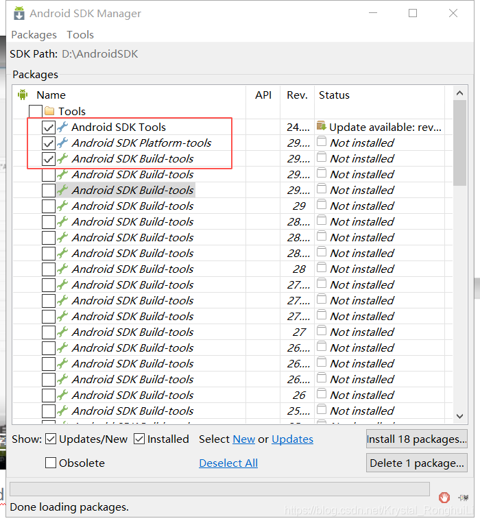
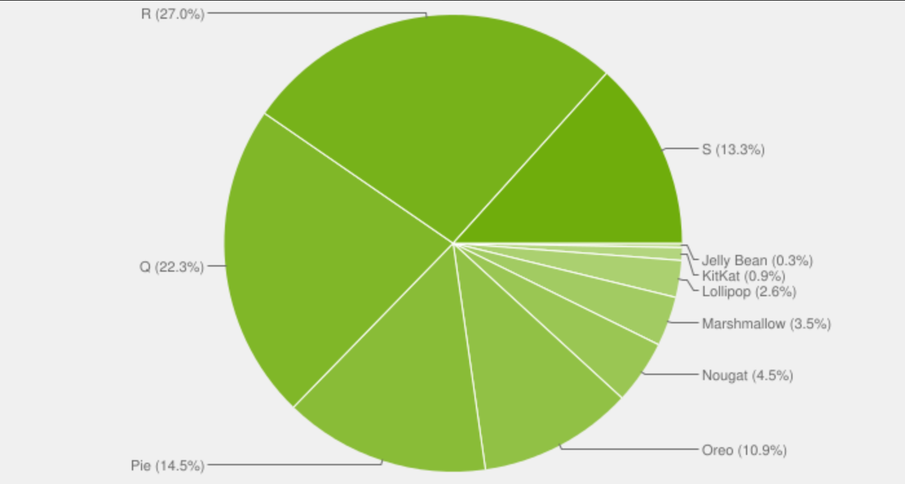
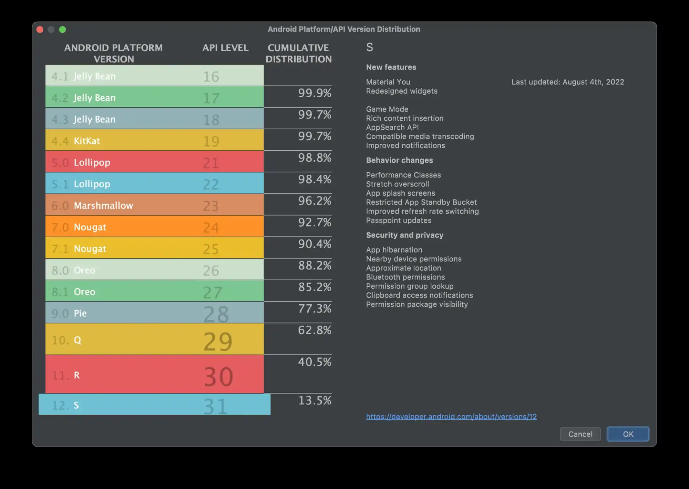

## Flutter介绍&安装教程

官网（https://flutter.cn/）（https://flutter.dev/）

[Flutter](https://flutter.dev/) is a cross-platform framework developed by Google in May 2017. It is built with the Dart programming language, a C-based language also developed by Google. 



Flutter uses the same Skia graphics rendering engine as Google Chrome. This allows the framework to write pixels directly to the screen instead of interacting with the native APIs. Because of this, the graphics rendering is independent of platform. This is how game engines render graphics. Game developers do not rewrite their code for each platform, they simply port the graphics rendering to each device. This makes Flutter more resilient to lower-level changes of native operating system APIs. The downside to this approach is felt on the web. Since Flutter is writing UIs pixel by pixel, the web implementation writes these pixels to a single canvas element. This makes some of the more standard web browser actions (right clicks, control-f searching, etc.) harder to implement. 

- 单一窗口
- UI自绘像素，使用C++的Skia库，谷歌的Chrome也是使用Skia
- 主要用于
  - 安卓移动
  - IOS移动

## Windows平台，安装flutter开发环境

教程：https://flutter.cn/docs/get-started/install/windows

- [博客 Android Studio下Flutter环境搭建图文教程](https://cloud.tencent.com/developer/article/1738413#:~:text=Flutter%20%E7%9A%84%E7%8E%AF%E5%A2%83%E6%90%AD%E5%BB%BA%E2%BC%97%E5%88%86%E7%9C%81%E2%BC%BC%EF%BC%8C%E7%89%B9%E5%88%AB%E5%AF%B9%E5%BA%94Android%E5%BC%80%E5%8F%91%E8%80%85%E2%BD%BD%E2%BE%94%EF%BC%8C%E5%8F%AA%E6%98%AF%E5%9C%A8AndroidStuido%E4%B8%8A%E5%AE%89%E8%A3%85,%E6%8F%92%E4%BB%B6%EF%BC%8C%E5%B9%B6%E4%B8%8B%E8%BD%BDflutterSdk%E5%88%B0%E6%9C%AC%E5%9C%B0%EF%BC%8C%E9%85%8D%E7%BD%AE%E5%9C%A8%E7%8E%AF%E5%A2%83%E5%8F%98%E9%87%8F%E5%8D%B3%E5%8F%AF%EF%BC%8C%E5%85%B6%E5%AE%9E%20%E4%B8%AD%E2%BD%82%E2%BD%B9%E7%9A%84%E6%90%AD%E5%BB%BAFutter%E5%BC%80%E5%8F%91%E7%8E%AF%E5%A2%83%20%E5%B7%B2%E7%BB%8F%E5%BE%88%E8%B4%B4%E2%BC%BC%E8%AF%A6%E7%BB%86%EF%BC%8C%E4%BB%8E%E5%B9%B3%E5%8F%B0%E6%8C%87%E5%BC%95%E5%BC%80%E5%A7%8B%E5%AE%89%E8%A3%85%E5%9F%BA%E6%9C%AC%E9%83%BD%E4%B8%8D%E4%BC%9A%E9%81%87%E5%88%B0%E9%97%AE%E9%A2%98%E3%80%82))

## 环境配置

官网中文安装教程：https://flutter.cn/docs/get-started/install/windows

1.安装flutter，配置环境变量

2.安装Android SDK

3.visual studio安装C++组件



4.中国大陆，需要配置中国镜像地址

## 检查环境是否安装成功

打开power shell输入以下命令

```
 flutter doctor
```
## 安装成功


## 环境配置问题

### 1.cmdline-tools component is missing

教程：https://blog.csdn.net/ZXHL_hxf/article/details/121208026



### 2.失败Android licenses not accepted

解决办法
1、运行flutter doctor --android-licenses命令
2、一直输入Y就可以了


### 3.Flutter SDK找不到 

- Flutter SDK找不到 

- Dart SDK找不到



### 4.安装Tools



### 5.配置 Flutter 中国镜像

- 教程：https://www.jianshu.com/p/897a78aec874

- [博客教程](https://blog.csdn.net/qq_28948031/article/details/119638296?spm=1001.2101.3001.6650.5&utm_medium=distribute.pc_relevant.none-task-blog-2%7Edefault%7EBlogCommendFromBaidu%7ERate-5-119638296-blog-105270415.pc_relevant_multi_platform_whitelistv3&depth_1-utm_source=distribute.pc_relevant.none-task-blog-2%7Edefault%7EBlogCommendFromBaidu%7ERate-5-119638296-blog-105270415.pc_relevant_multi_platform_whitelistv3&utm_relevant_index=7)

- [Android studio配置flutter 教程](


## 安卓版本选择2022年8月

**2022年8月**





## Android Studio插件

1.flutter

2.dart