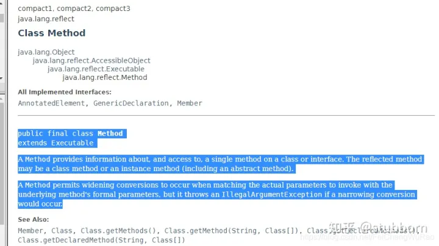

## Java 反射invoke

https://zhuanlan.zhihu.com/p/350058223




大概意思就是说提供类或者接口的方法信息，就可以访问调用对应的方法。

invoke的意思上就有调用的意思，也就是说我们可以通过反射包下的Method类调用invoke方法，调用我们所提供的方法以及调用方法的参数来完成动态调用。

也就是根据你给的对象/实例，方法名，以及参数来调用。找了个“替身”来帮你调用方法。

2 invoke方法的使用
实际上invoke方法的使用，和我们常见的有所区别。

我们经常创建一个对象A，A对象里面的方法getA()方法，然后A.getA()

我们采用新的方式调用
（1）弄一个方法的“替身”（其实就是构建一个Method对象，让这个Method对象来代替你现在要用的方法）
（2）然后给替身需要的对象和参数，让替身去替你调用（像JOJO的替身替你去战斗）

具体代码演示如下：

```java
public class InvokeTest {
    public void test(String[] arg){
        for (String string : arg) {
            System.out.println("zp is " + string);
        }
    }
    @Test
    public void invokeDemo() throws Exception {
        //获取字节码对象,这里要填好你对应对象的包的路径
        Class<InvokeTest> clazz = (Class<InvokeTest>) Class.forName("com.example.zp.demo.testDemo.InvokeTest");
        //形式一：获取一个对象
//        Constructor con =  clazz.getConstructor();
//        InvokeTest m = (InvokeTest) con.newInstance();
        //形式二：直接new对象，实际上不是框架的话，自己写代码直接指定某个对象创建并调用也可以
        InvokeTest m = new InvokeTest();
        String[] s = new String[]{"handsome","smart"};
        //获取Method对象
        Method method = clazz.getMethod("test", String[].class);
        //调用invoke方法来调用
        method.invoke(m, (Object) s);
    }
```

所以使用invoke方法要比别的方法多做一步，就是构建一个Method对象，这个对象替代的是现在程序要调用方法的替代品。

而且除了参数以外，invoke还会多要一个对象，因为方法调用需要对象，所以invoke要想调用的目标方法，就需要目标方法的需要的对象。

看起来invoke方法不仅比平常方法直接调用要麻烦很多，但是你有想过吗，我只需要输入参数，我可以调用替代各种方法，在未知的情况下，根据条件决定去调用什么对象，什么方法，一下子就让代码变得灵活，这不仅是invoke的妙处，也是整个反射的妙处，在程序运行时根据条件灵活使用。