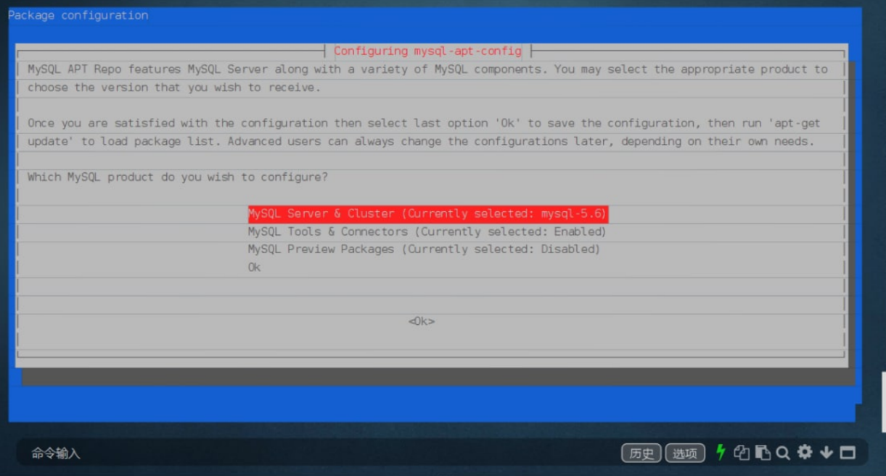

https://linuxize.com/post/how-to-install-mysql-on-debian-9/

debian服务器没有防火墙，安装的版本是mysql5.6




```
wget http://repo.mysql.com/mysql-apt-config_0.8.10-1_all.deb
```

```
sudo apt install ./mysql-apt-config_0.8.10-1_all.deb
```

或,sudo在debian系统只有一个root用户，不需要

```
apt install ./mysql-apt-config_0.8.10-1_all.deb
```


---------------------


### 数据库修改权限，允许远程

https://www.jianshu.com/p/b89c275cf3cb


## 一. 修改数据表

### 1.进入 mariadb

```
mysql -u root -p
```

### 2.修改表


```sql
MariaDB [mysql]> GRANT ALL PRIVILEGES ON *.* TO 'root'@'%' IDENTIFIED BY 'root';
Query OK, 0 rows affected (0.00 sec)
```

- 第一个*位置,为数据库, 第二个*位置,为表,所以 `*.*`,表示可以访问任意数据的任意表
- `'root'@'%'`, `root`表示远端登录使用的用户名,`%`表示允许任意ip登录,可将指定ip替换掉`%`, `root`与`%`可以自定义
- `IDENTIFIED BY 'root'` 这个`root` 是登录时的使用的密码,(方便记忆就用了root,生产环境一定要替换掉)

### 3.查看修改后


```ruby
MariaDB [mysql]> SELECT host,user,password from user;
+-----------+------+-------------------------------------------+
| host      | user | password                                  |
+-----------+------+-------------------------------------------+
| localhost | root | *81F5E21E35407D884A6CD4A731AEBFB6AF209E1B |
| %         | root | *81F5E21E35407D884A6CD4A731AEBFB6AF209E1B |
+-----------+------+-------------------------------------------+
2 rows in set (0.00 sec)
```

- | %         | root | *81F5E21E35407D884A6CD4A731AEBFB6AF209E1B |表示修改成功

## 二. 修改配置文件

将`/etc/mysql/mariadb.conf.d/50-server.cnf`中`bind-address = 127.0.0.1`加`#` 注释掉

## 三.重启服务


```css
 systemctl restart mariadb.service
```

## 四.远程链接

```
mysql -u root -proot -h 192.168.199.240 -D mysql
```


```dart
Reading table information for completion of table and column names
You can turn off this feature to get a quicker startup with -A

Welcome to the MariaDB monitor.  Commands end with ; or \g.
Your MariaDB connection id is 8
Server version: 10.1.34-MariaDB-0ubuntu0.18.04.1 Ubuntu 18.04

Copyright (c) 2000, 2018, Oracle, MariaDB Corporation Ab and others.

Type 'help;' or '\h' for help. Type '\c' to clear the current input statement.

MariaDB [mysql]> 
```

作者：会理发的店小二
链接：https://www.jianshu.com/p/b89c275cf3cb
来源：简书